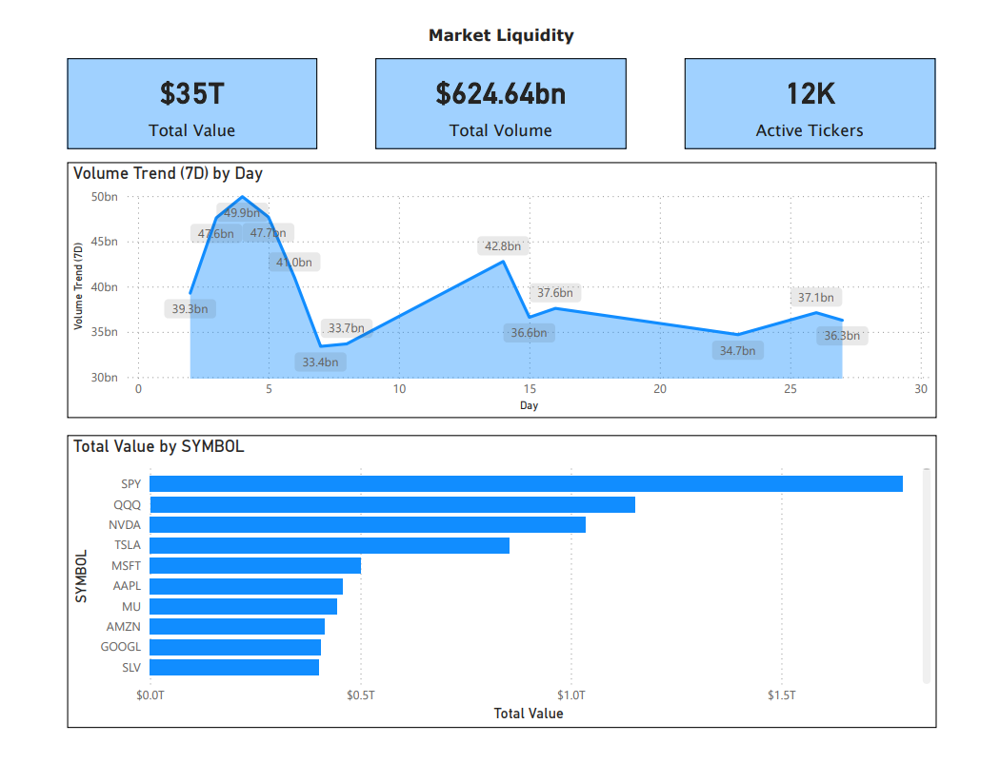

# Polygon EOD Pipeline with Airflow, S3, and Snowflake

Data pipeline project that uses Airflow to orchestrate Polygon EOD ingestion to S3 and Snowflake, with test DAGs for AWS and Snowflake connectivity, running in Docker.

## Quick Start

1. Start services:
   ```bash
   docker-compose up -d
   ```

2. Open the UI:
   - http://localhost:8080
   - Username: `admin`
   - Password: `admin`

## DAGs

- `polygon_modern_elt_v2` - Polygon EOD to S3 to Snowflake
- `test_aws_conn` - S3 connectivity check
- `test_snowflake_conn` - Snowflake connectivity check

## Configuration

Create a `.env` file in the project root and provide runtime secrets (for example AWS and Snowflake credentials).

Set these in Airflow UI (Admin -> Variables):

- `POLYGON_API_KEY`
- `S3_BUCKET`
- `SNOWFLAKE_STAGE_PREFIX` (default: `market/bronze/`)

Connections (Admin -> Connections):

- `aws_default`
- `snowflake_default`
## Architecture 


## Assets

- Power BI template: [powerbi/daily_market_eod.pbit](powerbi/daily_market_eod.pbit)
- Power BI DAX measures: [powerbi/dax_measures.md](powerbi/dax_measures.md)

### Dashboard Preview




## Useful Commands

```bash
docker-compose logs -f scheduler
docker-compose logs -f airflow
docker-compose logs -f postgres
docker-compose restart
docker-compose down
docker-compose down -v
```
